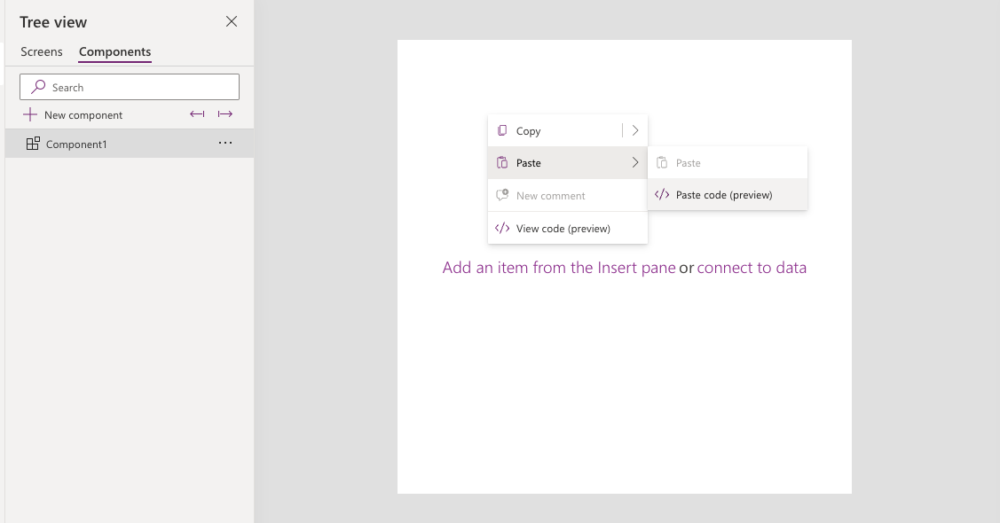

# Animated Canvas Buttons with CSS-style SVG Effects

Bring your Canvas Power Apps to life with animated SVG buttons styled to mimic CSS hover and microinteraction effects. Use this reusable snippet to apply visual polish and responsiveness to buttons via declarative YAML.

## Authors

Snippet|Author(s)
--------|---------
Animated CSS SVG Button | [Felix Verduin](https://github.com/felixverduin) ([Hashnode](https://fsvtech.hashnode.dev/) / [LinkedIn](https://www.linkedin.com/in/felixverduin/))

## Minimal path to awesome

> **_NOTE:_** The recommended best practice is to utilize this YAML snippet inside of a canvas component for reusability.

1. Open your canvas app in **Power Apps**
1. Copy the contents of the **[YAML-file](./source/AnimatedSVGButton.yaml)**
1. Right click on the screen where you want to add the snippet and select **Paste YAML**

## Steps to use as a component

1. Open your Power App in edit mode
1. Select the **components** tab in the tree view  

1. Select **New component**
1. Rename your component to something relevant like **AnimatedButton**
1. Add the following inputs:
   - `Text` (string): The button label
   - `OnSelect` (action): The click behavior
   - `IsPrimary` (boolean): Toggle for primary/secondary style
1. Right click inside the component and select **Paste Code**  

1. Replace the default label control with the animated SVG and bind it to the inputs:
   - Use `Text` for the label content
   - Use `OnSelect` for the click logic
   - Conditionally update SVG styles based on `IsPrimary`
1. Save and publish your component

## Disclaimer

**THIS CODE IS PROVIDED *AS IS* WITHOUT WARRANTY OF ANY KIND, EITHER EXPRESS OR IMPLIED, INCLUDING ANY IMPLIED WARRANTIES OF FITNESS FOR A PARTICULAR PURPOSE, MERCHANTABILITY, OR NON-INFRINGEMENT.**

